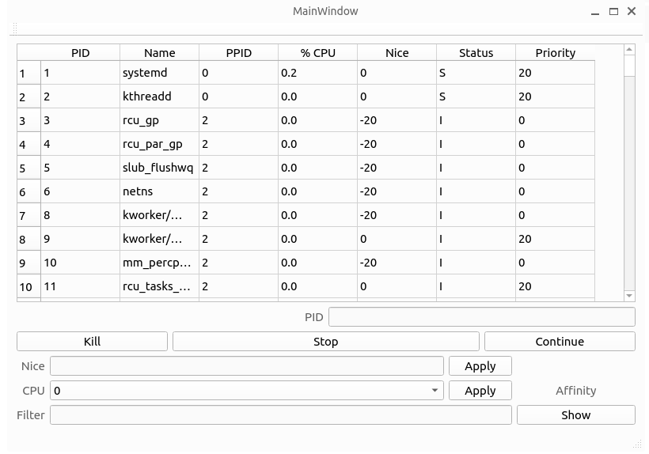

# Process Manager 🚀

This project is a simple Process Manager made with Qt Creator. It allows monitoring, killing, pausing, resuming processes, and changing CPU affinity and priority of processes.

## ✨ Features

- Monitor running processes
- Kill processes
- Pause processes
- Resume paused processes
- Change a process's CPU affinity
- Change a process's priority
- Automatically update the process list
- Filter processes by name

---


## 📐 How to Run

The project was created using Qt Creator, so it is necessary to have Qt Creator installed to compile and run the project.

1️⃣ Clone this repository
```bash
git clone https://github.com/thaisaraujo2000/process-manager.git
```

2️⃣ Go to the directory of the project
```bash
cd process-manager
```

3️⃣ Build

To compile the project, open the `.pro` file in Qt Creator and click on Build.

4️⃣ Run

To run the project, click on Run in Qt Creator.

## ⚙️ Code Architecture

The code architecture is based on the MainWindow class. This class controls the user interface and manages the processes.

The code makes extensive use of Qt functionalities, like QProcess to manage processes, QTimer to update the process list, and various widgets like QTableWidget, QPushButton, and QLineEdit.

The code also utilizes various operating system functionalities, like the `kill` function to kill or send signals to processes, and the `getpriority` and `setpriority` functions to get and set the priority of a process.

## 👥 Team Members

- [Morsinaldo Medeiros](https://github.com/Morsinaldo)
- [Thaís Medeiros](https://github.com/thaisaraujo2000)

## 📝 License

This project is licensed under the MIT License - see the [LICENSE](LICENSE) file for details.